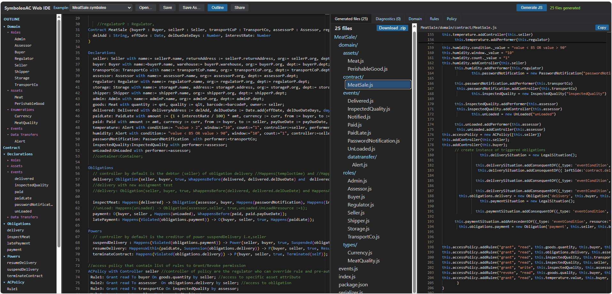
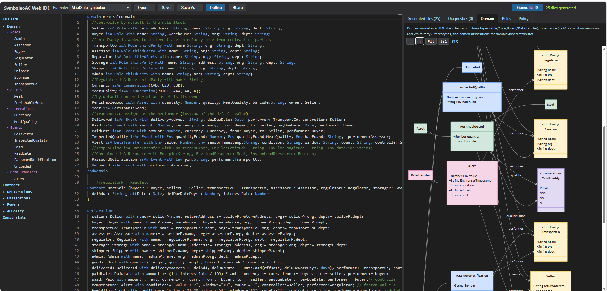
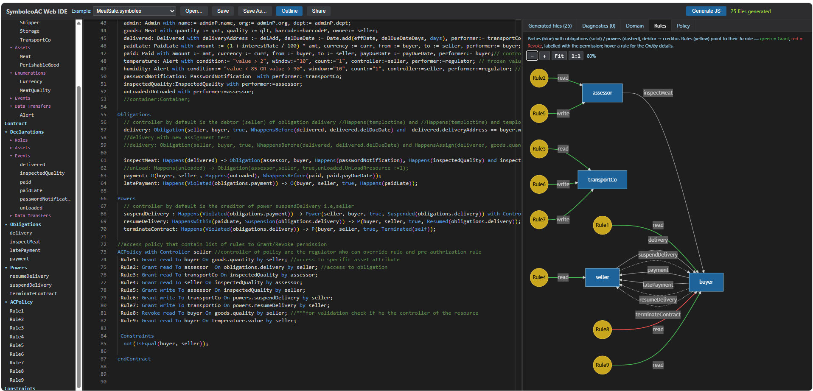
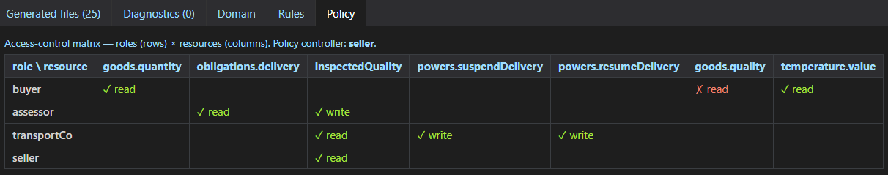

# SymboleoAC Web IDE

**Write, validate, and compile SymboleoAC legal contracts — right in your browser. No install, no Eclipse, no setup.**

[](https://github.com/Smart-Contract-Modelling-uOttawa/SymboleoAC-Web/actions/workflows/deploy-web.yml)

[**SymboleoAC**](https://github.com/Smart-Contract-Modelling-uOttawa/SymboleoAC-IDE) is a domain‑specific language from the University of Ottawa's Smart Contract Modelling Lab for specifying legal contracts — parties, assets, events, obligations, powers, and access‑control policies — precisely enough to reason about and execute them. Until now it lived only inside an Eclipse plugin.

**This project brings the full SymboleoAC language experience to the web**, backed by the *exact same* Xtext engine that powers the Eclipse IDE — so you get real diagnostics, real completion, and real code generation, with nothing to download.

### ▶️ Try it now: **https://smart-contract-modelling-uottawa.github.io/SymboleoAC-Web/**

---



*The IDE at a glance — resizable panels:*
1. **Outline (far left):** the contract's structure — Domain and Declarations broken down by category (Roles, Assets, Events, …), plus Obligations, Powers, and the AC Policy. Sections expand/collapse and every entry is clickable to jump to it in the editor.
2. **Editor:** your SymboleoAC contract with syntax highlighting and live red‑squiggle diagnostics. Here the `MeatSale` example is open.
3. **Generated files:** after clicking **Generate JS**, the multi‑file JavaScript package appears as a navigable tree (`domain/contract`, `domain/roles`, `domain/events`, …) with a **Download .zip** button.
4. **File viewer (right):** the selected generated file, JavaScript‑syntax‑highlighted and read‑only, with a one‑click **Copy**.

### Visualize the model

Beyond the editor, three tabs turn the contract into interactive diagrams — all auto‑generated from the live model as you type.

| Domain class diagram | Rules network | Policy matrix |
|---|---|---|
| [](docs/screenshot-domain.png) | [](docs/screenshot-rules.png) | [](docs/screenshot-policy.png) |
| **Domain** — the domain ontology as a UML class diagram, colour‑coded by category (roles, assets, events, data transfers, enumerations), with inheritance, stereotypes, and named associations. Zoom and pan; relayouts to fill the panel. | **Rules** — access‑control rules as a colour‑coded network: parties with their obligations/powers, and rules pointing to their target role (green = Grant, red = Revoke). Hover a rule for the *On*/*by* details. | **Policy** — the access‑control policy as a roles × resources matrix, with ✓ Grant (green) / ✗ Revoke (red). |

---

## ✨ Top features

| # | Feature | What it means for you |
|---|---------|------------------------|
| 1 | **Real Xtext language server** | The same engine as the Eclipse plugin runs behind the page — not a watered‑down web imitation. |
| 2 | **Live validation** | Type a contract and see errors/warnings instantly as red & yellow squiggles, straight from SymboleoAC's own `@Check` rules. |
| 3 | **Context‑aware completion** | Press <kbd>Ctrl</kbd>+<kbd>Space</kbd> for grammar‑correct suggestions — keywords, roles, events, obligation references. |
| 4 | **Instant syntax highlighting** | Keywords, types, operators and comments are colourised the moment the page loads (no server round‑trip needed). |
| 5 | **One‑click JavaScript generation** | Turn a contract into a runnable Node/JS package (built on `symboleoac-js-core`) with the **Generate JS** button. |
| 6 | **Smart code formatter** | <kbd>Shift</kbd>+<kbd>Alt</kbd>+<kbd>F</kbd> re‑indents the whole contract (3‑space), lays out obligations/powers across readable lines, reflows long boolean conditions, and collapses stray blank lines. |
| 7 | **Built‑in examples** | Start instantly from real contracts (`MeatSale`, `VaccineProcurement`) via the **Example** dropdown. |
| 8 | **Open & Save to disk** | Load a `.symboleo` file and save edits back **in place** (Chrome/Edge File System Access API), with **Save As** and a download fallback everywhere else. |
| 9 | **Generated‑code browser** | Explore the generated package as a file tree, view each file with JS/JSON highlighting, **Copy** a file, or **Download .zip** the whole thing. |
| 10 | **Structured outline** | A live, sectioned outline of the contract — Domain and Declarations decomposed by category — with expand/collapse and click‑to‑navigate to any element in the editor. |
| 11 | **Domain class diagram** | See the domain ontology as a colour‑coded UML class diagram (inheritance, stereotypes, associations) with zoom controls that relayout to fill the panel. |
| 12 | **Rules network diagram** | Visualize access‑control rules as a colour‑coded network (green Grant / red Revoke) over the parties' obligations and powers — hover a rule for its *On*/*by* details. |
| 13 | **Share by link** | The **Share** button packs the current contract into a URL — send it and the recipient opens the exact same model, no server storage. |
| 14 | **Zero‑install & secure** | A static front end on GitHub Pages talking to the backend over `wss://`/`https://` — open a URL and you're working. |

---

## 👤 For users

1. **Open the app:** <https://smart-contract-modelling-uottawa.github.io/SymboleoAC-Web/>
2. **Start from an example** (Example dropdown) or **Open…** a `.symboleo` file from your computer.
3. **Edit** — diagnostics update live; <kbd>Ctrl</kbd>+<kbd>Space</kbd> for completion; <kbd>Shift</kbd>+<kbd>Alt</kbd>+<kbd>F</kbd> to format.
4. **Navigate** with the **Outline** — click any element to jump to it; expand/collapse the sections.
5. **Visualize** — switch to the **Domain**, **Rules**, or **Policy** tabs to see the model as diagrams (zoom and hover for detail).
6. **Generate JS** — click the button; browse the generated files; **Copy** a file or **Download .zip**.
7. **Share** — click **Share** to copy a self‑contained link to the current contract.
8. **Save** / **Save As…** your contract back to disk.

> **Browser note:** *Save in place* and *Open* use the File System Access API (Chrome & Edge). Firefox/Safari fall back to a normal file‑open dialog and a download for saving. Everything else works in all modern browsers.

> **First‑use latency:** the first completion/diagnostic in a fresh session can take a second or two while the language server warms up — this is normal and only happens once per session.

---

## 🏗️ How it works

```
 Browser (static, GitHub Pages, HTTPS)
   └─ Monaco editor
        ├─ Monarch grammar ............ instant client‑side highlighting
        └─ monaco-languageclient ── wss ──┐
                                          │
 VPS (Docker)                             │
   ┌──────────────────────────────────────────────┐
   │ Caddy — automatic TLS + reverse proxy         │
   └───────────────┬──────────────────────────────┘
                   │ ws / http (localhost)
   ┌───────────────▼──────────────────────────────┐
   │ Node bridge (Express + ws)                    │
   │  • /lsp      → spawns an Xtext LSP per session │
   │  • /generate → runs the JS code‑gen CLI        │
   │  • /model    → extracts the structured model   │
   └───────────────┬──────────────────────────────┘
                   │ child process (stdio / stdin‑stdout)
   ┌───────────────▼──────────────────────────────┐
   │ Xtext language server  +  JS code‑gen, as fat │
   │ jars (reuse the upstream grammar & generator) │
   └───────────────────────────────────────────────┘
```

- **Front end** — Vite + React + Monaco via `monaco-languageclient` v10. Syntax highlighting comes from a Monarch grammar auto‑extracted from the upstream `.xtext` grammar at build time.
- **Bridge** — a small Node service that pipes LSP JSON‑RPC over a WebSocket to a per‑session `java` language server, and exposes `POST /generate` (JS code‑gen) and `POST /model` (structured model for the Outline and diagrams).
- **Language tooling** — two self‑contained jars built from the vendored [`SymboleoAC-IDE`](https://github.com/Smart-Contract-Modelling-uOttawa/SymboleoAC-IDE) sources: the Xtext LSP server, and a headless CLI that both generates JavaScript (`Symboleo2SC`) and extracts the structured model (`--model`) used by the Outline and diagrams.
- **TLS** — Caddy terminates HTTPS/WSS and auto‑provisions a Let's Encrypt certificate.

---

## 🧑‍💻 For developers

### Repository layout

```
SymboleoAC-Web/
├─ web/              Vite/React/Monaco front end (deploys to GitHub Pages)
├─ bridge/           Node WebSocket↔LSP bridge + /generate  (+ verify scripts)
├─ language-server/  Maven module → Xtext LSP fat jar (+ custom formatter)
├─ codegen-cli/      Maven module → headless JS generator fat jar
├─ infra/            docker-compose.yml + Caddyfile
├─ upstream/         vendored SymboleoAC-IDE sources (see UPSTREAM_PROVENANCE.md)
├─ .github/workflows/deploy-web.yml   GitHub Pages CI
├─ DEPLOY.md         VPS + Pages deployment runbook
├─ VERSIONS.md       every pinned version (incl. Xtext/lsp4j ↔ LSP spec)
└─ CLAUDE.md         architecture notes & upstream gotchas
```

### Prerequisites

| Tool | Version | Needed for |
|---|---|---|
| JDK | 17+ (built/tested with Temurin 21) | the jars |
| Maven | 3.8+ | the jars |
| Node | 20+ | bridge & web |
| Docker + Compose v2 | recent | the turnkey local/VPS stack (optional) |

### Quick start — option A: Docker (turnkey, only Docker needed)

The bridge image **builds the jars from source itself**, so a fresh clone runs with nothing but Docker:

```bash
git clone https://github.com/Smart-Contract-Modelling-uOttawa/SymboleoAC-Web.git
cd SymboleoAC-Web
APP_DOMAIN=":80" docker compose -f infra/docker-compose.yml up -d --build   # backend on http://localhost
# then run the web front end against it:
cd web && npm ci && VITE_LSP_URL=ws://localhost/lsp VITE_API_URL=http://localhost npm run dev
```

### Quick start — option B: manual (fast iteration)

```powershell
# 1) Build the two jars (Maven). On Windows behind a corporate proxy:
#    $env:MAVEN_OPTS = "-Djavax.net.ssl.trustStoreType=Windows-ROOT"
cd language-server ; mvn -B clean package ; cd ..
cd codegen-cli     ; mvn -B clean package ; cd ..

# 2) Run the bridge (serves /lsp and /generate on :3030)
cd bridge ; npm ci ; npm run build
$env:LS_JAR      = (Resolve-Path ../language-server/target/symboleoac-language-server-1.0.0-all.jar).Path
$env:CODEGEN_JAR = (Resolve-Path ../codegen-cli/target/symboleoac-codegen-cli-1.0.0-all.jar).Path
$env:PORT = "3030" ; node build/index.js

# 3) Run the web app (in another terminal); web/.env.local already points at :3030
cd web ; npm ci ; npm run dev      # http://localhost:5173
```

> The front end reads `VITE_LSP_URL` / `VITE_API_URL` (see `web/.env.local` for local dev). Highlighting works even with no backend; diagnostics/completion/generate need the bridge.

### Verifying the backend

`bridge/` ships smoke‑test scripts you can run against any bridge URL:

```bash
node bridge/test-ws.mjs          ws://localhost:3030/lsp   # LSP initialize handshake
node bridge/test-diagnostics.mjs ws://localhost:3030/lsp   # live diagnostics round‑trip
node bridge/test-completion.mjs  ws://localhost:3030/lsp   # completion proposals
node bridge/test-format.mjs      ws://localhost:3030/lsp <file>   # formatter output
node bridge/test-generate.mjs                              # POST /generate
```

### Configuration (bridge env vars)

| Var | Default | Meaning |
|---|---|---|
| `LS_JAR`, `CODEGEN_JAR` | — | paths to the two jars (set in the image) |
| `PORT` | `3000` | listen port |
| `MAX_SESSIONS` | `8` | concurrent LSP sessions |
| `JVM_XMX` | `512m` | heap per session |
| `ALLOW_ORIGIN` | `*` | CORS origin for `/generate` (lock to the Pages origin in prod) |
| `IDLE_TIMEOUT_MS` | `600000` | reap idle LSP sessions |
| `RATE_MAX` / `RATE_WINDOW_MS` | `20` / `60000` | per‑IP rate limit on `/generate` and `/model` |
| `MAX_CONCURRENT_GEN` | `4` | cap on simultaneous code‑gen / model processes |

Full list and endpoint docs: [`bridge/README.md`](bridge/README.md).

### Deployment & updates

The complete runbook is in **[DEPLOY.md](DEPLOY.md)**. In short:

- **Front end (GitHub Pages):** pushing to `main` runs `.github/workflows/deploy-web.yml`. Set repo **Variables** `APP_DOMAIN` (backend host) and `PAGES_BASE` (`/SymboleoAC-Web/`).
- **Back end (VPS):** `git pull` then `docker compose -f infra/docker-compose.yml up -d --build`. Caddy handles TLS automatically once DNS points at the box.

### Regenerating language artifacts

The Xtext **content‑assist parser** (for completion) and any **grammar/validator** changes are regenerated by running MWE2 in Eclipse — see [`language-server/IDE-COMPLETION-BOOTSTRAP.md`](language-server/IDE-COMPLETION-BOOTSTRAP.md). The custom **formatter** lives in `language-server/src/.../SymboleoFormatter.java` (plain Java, no Eclipse needed).

---

## 📌 Notes & known limits

- **JS‑only code generation.** SymboleoAC targets JavaScript (`Symboleo2SC`). The legacy nuXmv model‑checker path from the older *Symboleo* language is intentionally out of scope.
- **Versions are pinned** in [`VERSIONS.md`](VERSIONS.md); the LSP spec is kept aligned between the server (lsp4j 0.23.1 → LSP 3.17) and the browser client.
- **Cost:** front end + CI are free; the only paid piece is a small always‑on VPS (~€4/mo).

## 🙏 Acknowledgements

Built on the [SymboleoAC‑IDE](https://github.com/Smart-Contract-Modelling-uOttawa/SymboleoAC-IDE) language, grammar, validators, and JavaScript generator from the **University of Ottawa Smart Contract Modelling Lab**. This project wraps that work for the web; all language semantics are theirs.

## 📄 License

See [`LICENSE`](LICENSE).
