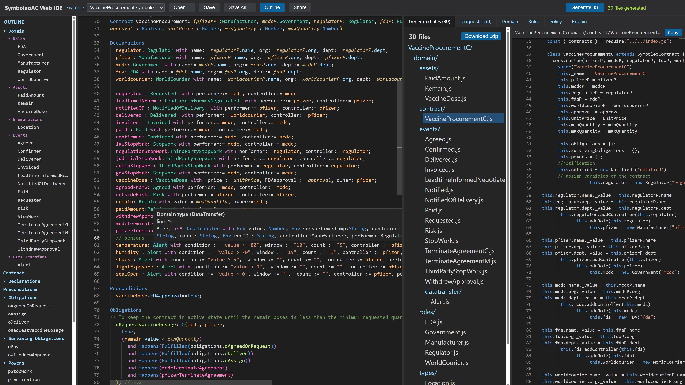
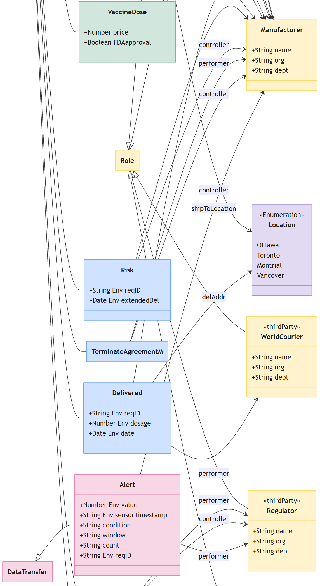
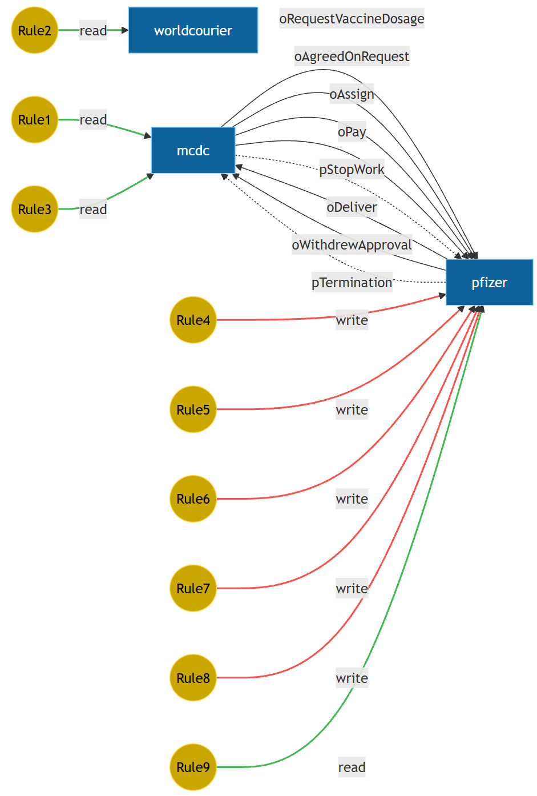
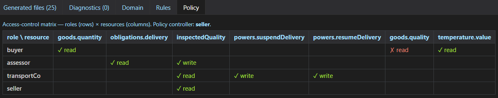
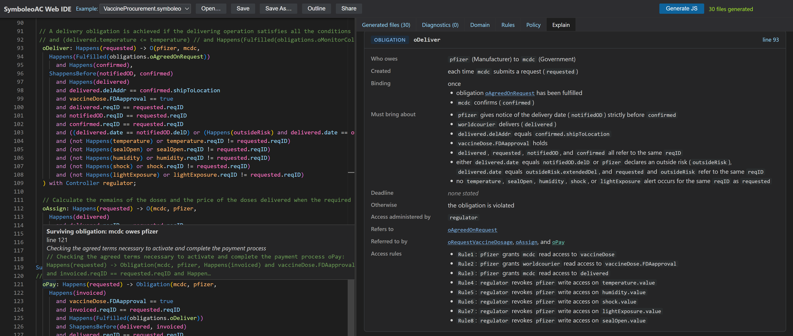
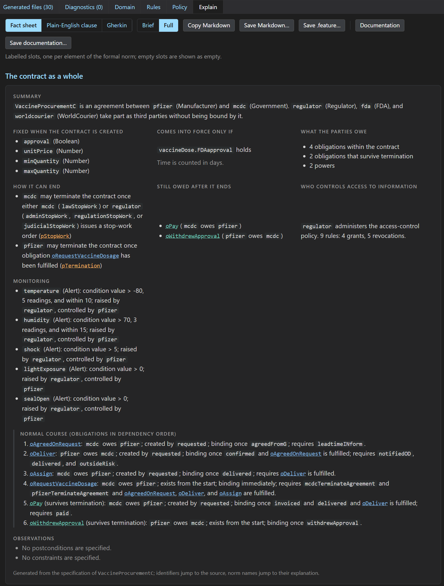
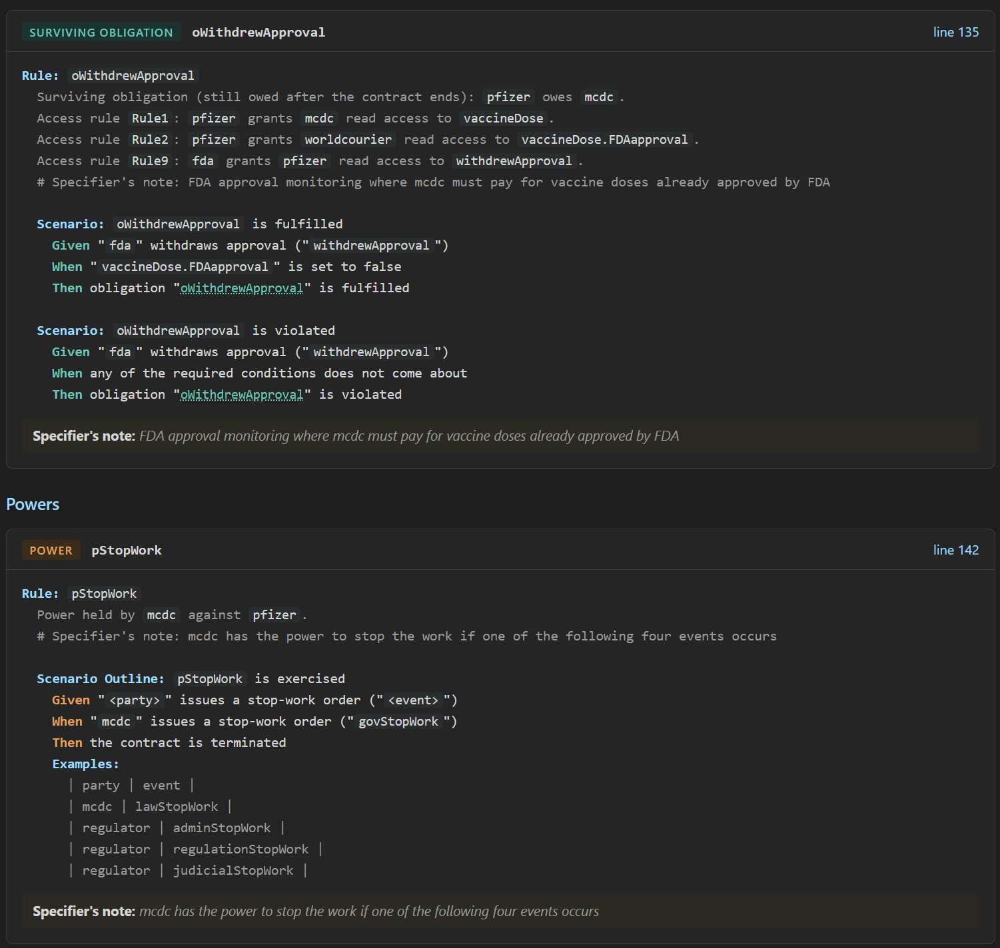

# SymboleoAC Web IDE

**Write, validate, understand, and compile SymboleoAC legal contracts — right in your browser. No install, no Eclipse, no setup.**

[](https://github.com/Smart-Contract-Modelling-uOttawa/SymboleoAC-Web/actions/workflows/deploy-web.yml)

[**SymboleoAC**](https://github.com/Smart-Contract-Modelling-uOttawa/SymboleoAC-IDE) is a domain‑specific language from the University of Ottawa's Smart Contract Modelling Lab for specifying legal contracts — parties, assets, events, obligations, powers, and access‑control policies — precisely enough to reason about and execute them. Until now it lived only inside an Eclipse plugin.

**This project brings the full SymboleoAC language experience to the web**, backed by the *exact same* Xtext engine that powers the Eclipse IDE — so you get real diagnostics, real completion, real navigation, and real code generation, with nothing to download. It also goes beyond the Eclipse IDE: every contract is turned into diagrams, into **plain‑language explanations** of each obligation and power, and into a self‑contained **documentation** file you can hand to people who will never read SymboleoAC.

### ▶️ Try it now: **https://smart-contract-modelling-uottawa.github.io/SymboleoAC-Web/**

---

## The IDE at a glance

[](docs/screenshot-overview.png)

*The `VaccineProcurement` example after **Generate JS**. Four resizable panels, left to right:*

1. **Outline:** the contract's structure — Domain and Declarations broken down by category (Roles, Assets, Events, …), then Obligations, Powers, and the AC Policy. Sections expand and collapse; every entry jumps to its line in the editor.
2. **Editor:** the SymboleoAC contract with live diagnostics and **semantic colouring** — every identifier is coloured by what it *is* (teal types, orange roles and assets, pink events, green obligations and powers, coral access rules, light‑blue attributes, gold parameters). Hovering a name tells you what it is and where it is declared (here the `Alert` data transfer, with its attributes) and, for a norm, what the specifier wrote about it; <kbd>F12</kbd> jumps to the declaration, <kbd>Shift</kbd>+<kbd>F12</kbd> lists the uses, <kbd>F2</kbd> renames.
3. **Generated files:** the multi‑file JavaScript package as a navigable tree (`domain/contract`, `domain/roles`, `domain/events`, …) with a **Download .zip** button.
4. **File viewer:** the selected generated file, syntax‑highlighted and read‑only, with one‑click **Copy**.

The tab bar above the right‑hand panel switches between **Generated files**, **Diagnostics**, the three diagram views (**Domain**, **Rules**, **Policy**) and the **Explain** tab described below, so a diagram or an explanation can stay open beside the editor.

## Visualize the model

Three tabs turn the contract into interactive diagrams, all regenerated from the live model as you type.

| Domain class diagram | Rules network | Policy matrix |
|---|---|---|
| [](docs/screenshot-domain.png) | [](docs/screenshot-rules.png) | [](docs/screenshot-policy.png) |
| **Domain** — the domain ontology as a UML class diagram, colour‑coded by category (yellow roles, green assets, blue events, pink data transfers, purple enumerations), with inheritance, stereotypes such as `«thirdParty»`, and named associations (`performer`, `controller`, `shipToLocation`, …). Zoom and pan; relayouts to fill the panel. | **Rules** — the parties and their norms: each obligation or power is an arrow from debtor to creditor (dotted for powers), and each access‑control rule points at the role it grants (green) or revokes (red) access for, labelled with the permission. Hover a rule for its *On*/*by* details. | **Policy** — the access‑control policy as a roles × resources matrix, with ✓ Grant (green) / ✗ Revoke (red). |

## Understand the contract — the Explain tab

[](docs/screenshot-explain.png)

*The **Explain** tab side by side with the editor. The `oDeliver` obligation is a fact sheet: who owes what to whom, when the obligation is created, when it becomes binding, what must be brought about, the deadline, what happens otherwise, the norms it depends on, and the access rules that touch the resources it reads. Thirteen formal conjuncts have become seven sentences: the three `reqID` equalities are one correlation clause, the five sensor exclusions one absence clause. Every identifier is coloured as in the editor and clicks through to its line; hovering shows its declaration.*

The Explain tab describes the contract in plain language, for people who are not going to read SymboleoAC: lawyers, procurement officers, students. Everything in it is **derived mechanically from the specification** — no language model, no hand‑written text — so what you read is what the contract says.

| The contract as a whole | Gherkin style |
|---|---|
| [](docs/screenshot-explain-contract.png) | [](docs/screenshot-gherkin.png) |
| The top of the tab, with its toolbar (style, Brief/Full, **Copy Markdown**, **Save Markdown…**, **Save .feature…**, **Documentation**, **Save documentation…**). The **Contract** block summarises the whole agreement: the parties (signatories vs. third parties), what is fixed when the contract is created, how it can end, what is still owed afterwards, who controls access, the sensors that monitor it, the *normal course* of its obligations in dependency order, and a few observations. | The same explanations rendered as a **Gherkin** feature file: every norm is a `Rule`, with one `Scenario` per outcome (*fulfilled* / *violated* for obligations, *exercised* for powers). A trigger with several alternatives, such as the four stop‑work orders of `pStopWork`, becomes a `Scenario Outline` with an `Examples` table. Identifiers are double‑quoted so Cucumber step definitions can bind them; the output parses with the reference parser. |

- **Every obligation, surviving obligation, and power** gets its own block: who owes what to whom, when the norm is created (its trigger), when it becomes binding (its antecedent), what must be brought about (its consequent), the deadline if one is stated, what happens otherwise, who administers access to it, which other norms it refers to and is referred to by, and which access‑control rules touch the resources it reads or writes.
- **Three styles**, switchable at any time: a **fact sheet** (labelled slots, nothing omitted), a **plain‑English clause** (one paragraph per norm, with enumerated conditions), and **Gherkin** (the contract is a `Feature`, the preconditions its `Background`). A **Brief / Full** toggle hides or shows the secondary slots.
- **Specifier's notes**: the comment written directly above a norm in the source is shown with it, clearly separated from the generated text.
- **Faithful wording**: identifiers appear exactly as written (`mcdc`, `delivered.reqID`); every reference to another norm is a hyperlink to its block; formal notions (`ShappensBefore` → *strictly before*, `true` antecedent → *immediately*) are rendered without softening them, and repeated patterns are collapsed into one sentence. Slot labels carry glossary tooltips.
- Explanations are shown only when the specification has **no validation errors** (warnings are tolerated); otherwise the tab lists the errors with clickable line numbers.
- **Copy Markdown / Save Markdown** export the explanations in the current style; **Save .feature…** exports the Gherkin rendering of the whole contract.

## Take it with you — integrated documentation

**Save documentation…** (in the Explain tab) writes **one self‑contained HTML file** — no external resources, works offline, prints cleanly — that combines: the contract overview, the domain class diagram and the parties/norms diagram (each in a left‑to‑right and a top‑to‑bottom layout, fit‑to‑width or actual size), the access‑control matrix and rule list, the explanations in all three styles with the style and Brief/Full switches still working, and the **specification itself**, coloured as in the editor, single‑spaced, with every reference hyperlinked to its declaration. Identifiers anywhere in the document jump to the line where they are declared. **Documentation** opens the same page in a new tab for a quick look.

**Sample report:** the documentation generated for the `VaccineProcurement` example — [open it live](https://smart-contract-modelling-uottawa.github.io/SymboleoAC-Web/docs/VaccineProcurementC-documentation.html) (or see [`web/public/docs/VaccineProcurementC-documentation.html`](web/public/docs/VaccineProcurementC-documentation.html) in the repository; download it and open it offline).

---

## ✨ Top features

| # | Feature | What it means for you |
|---|---------|------------------------|
| 1 | **Real Xtext language server** | The same engine as the Eclipse plugin runs behind the page — not a watered‑down web imitation. |
| 2 | **Live validation** | Type a contract and see errors/warnings instantly as red & yellow squiggles, straight from SymboleoAC's own `@Check` rules. |
| 3 | **Context‑aware completion** | Press <kbd>Ctrl</kbd>+<kbd>Space</kbd> for grammar‑correct suggestions — keywords, roles, events, obligation references. |
| 4 | **Signature help** | Typing inside a call shows its parameters with the active one highlighted — obligation/power constructors (`O`/`P`), predicates (`Happens`, `Occurs`, …), and `Math`/`String`/`Date` functions. |
| 5 | **Syntax + semantic highlighting** | Keywords, operators, strings and comments are colourised the moment the page loads (client‑side grammar). Once the language server has parsed the contract, **semantic tokens** colour every identifier by what it *is* — roles/assets, events, obligations/powers, access rules, domain types, enumeration values, attributes and parameters — at declarations and at every reference. Colours: teal = types, orange = role/asset instances, pink = events, green = obligations/powers, coral = access rules, light blue = attributes, gold italics = parameters. |
| 6 | **Go to Definition, Find References, Hover, Rename** | <kbd>F12</kbd> / <kbd>Ctrl</kbd>+click jumps from any reference — a role, event, asset, obligation, power, rule, type, parameter, or enumeration value — to its declaration; <kbd>Shift</kbd>+<kbd>F12</kbd> lists every use; hovering shows what an identifier is, where it is declared, and (for norms) the specifier's comment; <kbd>F2</kbd> renames it everywhere, refusing keywords and clashes. Works even though the SymboleoAC grammar references most names as plain identifiers. |
| 7 | **Plain‑language explanations (Explain tab)** | Every obligation, surviving obligation and power — and the contract as a whole — explained for non‑specialists in three switchable styles (fact sheet, plain‑English clause, **Gherkin** feature file that parses with the reference parser), generated deterministically from the specification with clickable identifiers and cross‑norm links. See *Understand the contract* above. |
| 8 | **Integrated documentation export** | One self‑contained, printable HTML file with the overview, both diagrams, the policy matrix, the explanations in all styles, and the syntax‑coloured, cross‑linked specification. |
| 9 | **One‑click JavaScript generation** | Turn a contract into a runnable Node/JS package (built on `symboleoac-js-core`) with the **Generate JS** button. |
| 10 | **Smart code formatter** | <kbd>Shift</kbd>+<kbd>Alt</kbd>+<kbd>F</kbd> re‑indents the whole contract (3‑space), lays out obligations/powers across readable lines, reflows long boolean conditions, and collapses stray blank lines. |
| 11 | **Built‑in examples & tutorial** | Start instantly from real contracts via the **Example** dropdown — `MeatSale`, `VaccineProcurement`, and the Incoterms 2020 `FOB` trade term — or learn the language with `Tutorial`, a deliberately broken contract whose 22 commented problems (naming, typing, declarations, norms, access control, syntax) you fix one by one until it compiles. |
| 12 | **Open & Save to disk** | Load a `.symboleo` file and save edits back **in place** (Chrome/Edge File System Access API), with **Save As** and a download fallback everywhere else. |
| 13 | **Generated‑code browser** | Explore the generated package as a file tree, view each file with JS/JSON highlighting, **Copy** a file, or **Download .zip** the whole thing. |
| 14 | **Structured outline** | A live, sectioned outline of the contract — Domain and Declarations decomposed by category — with expand/collapse and click‑to‑navigate to any element in the editor. |
| 15 | **Domain class diagram** | See the domain ontology as a colour‑coded UML class diagram (inheritance, stereotypes, associations) with zoom controls that relayout to fill the panel. |
| 16 | **Rules network diagram** | Visualize access‑control rules as a colour‑coded network (green Grant / red Revoke) over the parties' obligations and powers — hover a rule for its *On*/*by* details. |
| 17 | **Share by link** | The **Share** button packs the current contract into a URL — send it and the recipient opens the exact same model, no server storage. |
| 18 | **Zero‑install & secure** | A static front end on GitHub Pages talking to the backend over `wss://`/`https://` — open a URL and you're working. |

---

## 👤 For users

1. **Open the app:** <https://smart-contract-modelling-uottawa.github.io/SymboleoAC-Web/>
2. **Start from an example** (Example dropdown) or **Open…** a `.symboleo` file from your computer.
3. **Edit** — diagnostics update live; <kbd>Ctrl</kbd>+<kbd>Space</kbd> for completion; parameter hints appear inside calls (<kbd>Ctrl</kbd>+<kbd>Shift</kbd>+<kbd>Space</kbd> to force); <kbd>Shift</kbd>+<kbd>Alt</kbd>+<kbd>F</kbd> to format.
4. **Navigate** — <kbd>F12</kbd> (or <kbd>Ctrl</kbd>+click) on any name jumps to its declaration, <kbd>Shift</kbd>+<kbd>F12</kbd> lists its uses, hovering describes it, <kbd>F2</kbd> renames it everywhere; the **Outline** lists every element — click to jump, expand/collapse the sections.
5. **Visualize** — switch to the **Domain**, **Rules**, or **Policy** tabs to see the model as diagrams (zoom and hover for detail).
6. **Understand** — open the **Explain** tab for plain‑language explanations of each obligation and power and of the whole contract; pick a style (fact sheet, plain‑English clause, Gherkin) and Brief or Full; click identifiers to jump to the source and norm names to jump between explanations. Requires an error‑free specification.
7. **Document** — **Save documentation…** (Explain tab) writes one self‑contained HTML file with the overview, diagrams, policy matrix, explanations, and the cross‑linked specification; **Copy/Save Markdown** export the explanations alone.
8. **Generate JS** — click the button; browse the generated files; **Copy** a file or **Download .zip**.
9. **Share** — click **Share** to copy a self‑contained link to the current contract.
10. **Save** / **Save As…** your contract back to disk.

> **Browser note:** *Save in place* and *Open* use the File System Access API (Chrome & Edge). Firefox/Safari fall back to a normal file‑open dialog and a download for saving. Everything else works in all modern browsers.

> **First‑use latency:** the first completion/diagnostic in a fresh session can take a second or two while the language server warms up — this is normal and only happens once per session.

---

## 🏗️ How it works

```
 Browser (static, GitHub Pages, HTTPS)
   └─ Monaco editor
        ├─ Monarch grammar ............ instant client‑side highlighting
        └─ monaco-languageclient ── wss ──┐
                                          │
 VPS (Docker)                             │
   ┌──────────────────────────────────────────────┐
   │ Caddy — automatic TLS + reverse proxy         │
   └───────────────┬──────────────────────────────┘
                   │ ws / http (localhost)
   ┌───────────────▼──────────────────────────────┐
   │ Node bridge (Express + ws)                    │
   │  • /lsp      → spawns an Xtext LSP per session │
   │  • /generate → runs the JS code‑gen CLI        │
   │  • /model    → structured + explanation model  │
   └───────────────┬──────────────────────────────┘
                   │ child process (stdio / stdin‑stdout)
   ┌───────────────▼──────────────────────────────┐
   │ Xtext language server  +  JS code‑gen, as fat │
   │ jars (reuse the upstream grammar & generator) │
   └───────────────────────────────────────────────┘
```

- **Front end** — Vite + React + Monaco via `monaco-languageclient` v10. Syntax highlighting comes from a Monarch grammar auto‑extracted from the upstream `.xtext` grammar at build time.
- **Bridge** — a small Node service that pipes LSP JSON‑RPC over a WebSocket to a per‑session `java` language server, and exposes `POST /generate` (JS code‑gen) and `POST /model` (structured model for the Outline and diagrams, plus the explanation model and diagnostics for the Explain tab).
- **Language tooling** — two self‑contained jars built from the vendored [`SymboleoAC-IDE`](https://github.com/Smart-Contract-Modelling-uOttawa/SymboleoAC-IDE) sources: the Xtext LSP server (extended with a formatter, a semantic‑token calculator, and name‑based definition/references/hover/rename services, since the grammar references most names as plain identifiers rather than cross‑references), and a headless CLI that both generates JavaScript (`Symboleo2SC`) and extracts the structured model (`--model`), including the *explanation model* — a resolved, language‑independent description of every norm.
- **Explanations** — the codegen CLI emits structure only (parties, trigger/antecedent/consequent trees with every reference resolved, cross‑references, touched resources, matching access rules, the specifier's comment); all wording is produced in the browser by a deterministic rule‑based verbalizer (`web/src/explain/verbalize.ts`), so styles and phrasing evolve without rebuilding the jars. Design notes: [`EXPLAIN-PLAN.md`](EXPLAIN-PLAN.md).
- **TLS** — Caddy terminates HTTPS/WSS and auto‑provisions a Let's Encrypt certificate.

---

## 🧑‍💻 For developers

### Repository layout

```
SymboleoAC-Web/
├─ web/              Vite/React/Monaco front end (deploys to GitHub Pages)
│   └─ src/explain/  Explain tab: verbalizer, three styles, Markdown + documentation export
├─ bridge/           Node WebSocket↔LSP bridge + /generate + /model  (+ verify scripts)
├─ language-server/  Maven module → Xtext LSP fat jar (+ formatter, semantic tokens, definition/hover/rename)
├─ codegen-cli/      Maven module → headless JS generator + model/explanation extractor fat jar
├─ docs/             screenshots, Explain‑tab style prototype
├─ EXPLAIN-PLAN.md   design of the Explain tab and documentation export
├─ infra/            docker-compose.yml + Caddyfile
├─ upstream/         vendored SymboleoAC-IDE sources (see UPSTREAM_PROVENANCE.md)
├─ .github/workflows/deploy-web.yml   GitHub Pages CI
├─ DEPLOY.md         VPS + Pages deployment runbook
├─ VERSIONS.md       every pinned version (incl. Xtext/lsp4j ↔ LSP spec)
└─ CLAUDE.md         architecture notes & upstream gotchas
```

### Prerequisites

| Tool | Version | Needed for |
|---|---|---|
| JDK | 17+ (built/tested with Temurin 21) | the jars |
| Maven | 3.8+ | the jars |
| Node | 20+ | bridge & web |
| Docker + Compose v2 | recent | the turnkey local/VPS stack (optional) |

### Quick start — option A: Docker (turnkey, only Docker needed)

The bridge image **builds the jars from source itself**, so a fresh clone runs with nothing but Docker:

```bash
git clone https://github.com/Smart-Contract-Modelling-uOttawa/SymboleoAC-Web.git
cd SymboleoAC-Web
APP_DOMAIN=":80" docker compose -f infra/docker-compose.yml up -d --build   # backend on http://localhost
# then run the web front end against it:
cd web && npm ci && VITE_LSP_URL=ws://localhost/lsp VITE_API_URL=http://localhost npm run dev
```

### Quick start — option B: manual (fast iteration)

```powershell
# 1) Build the two jars (Maven). On Windows behind a corporate proxy:
#    $env:MAVEN_OPTS = "-Djavax.net.ssl.trustStoreType=Windows-ROOT"
cd language-server ; mvn -B clean package ; cd ..
cd codegen-cli     ; mvn -B clean package ; cd ..

# 2) Run the bridge (serves /lsp and /generate on :3030)
cd bridge ; npm ci ; npm run build
$env:LS_JAR      = (Resolve-Path ../language-server/target/symboleoac-language-server-1.0.0-all.jar).Path
$env:CODEGEN_JAR = (Resolve-Path ../codegen-cli/target/symboleoac-codegen-cli-1.0.0-all.jar).Path
$env:PORT = "3030" ; node build/index.js

# 3) Run the web app (in another terminal); web/.env.local already points at :3030
cd web ; npm ci ; npm run dev      # http://localhost:5173
```

> The front end reads `VITE_LSP_URL` / `VITE_API_URL` (see `web/.env.local` for local dev). Highlighting works even with no backend; diagnostics/completion/generate need the bridge.

### Verifying the backend

`bridge/` ships smoke‑test scripts you can run against any bridge URL:

```bash
node bridge/test-ws.mjs          ws://localhost:3030/lsp   # LSP initialize handshake
node bridge/test-diagnostics.mjs ws://localhost:3030/lsp   # live diagnostics round‑trip
node bridge/test-completion.mjs  ws://localhost:3030/lsp   # completion proposals
node bridge/test-format.mjs      ws://localhost:3030/lsp <file>   # formatter output
node bridge/test-generate.mjs                              # POST /generate
node bridge/test-explain.mjs     http://localhost:3030      # /model explanation + diagnostics blocks, all samples
node bridge/test-definition.mjs  ws://localhost:3030/lsp    # go‑to‑definition probes
node bridge/test-rename-hover.mjs ws://localhost:3030/lsp   # hover, prepareRename, rename probes
node bridge/test-semantic-tokens.mjs ws://localhost:3030/lsp # semantic-token legend + token types
```

### Configuration (bridge env vars)

| Var | Default | Meaning |
|---|---|---|
| `LS_JAR`, `CODEGEN_JAR` | — | paths to the two jars (set in the image) |
| `PORT` | `3000` | listen port |
| `MAX_SESSIONS` | `8` | concurrent LSP sessions |
| `JVM_XMX` | `512m` | heap per session |
| `ALLOW_ORIGIN` | `*` | CORS origin for `/generate` (lock to the Pages origin in prod) |
| `IDLE_TIMEOUT_MS` | `600000` | reap idle LSP sessions |
| `RATE_MAX` / `RATE_WINDOW_MS` | `20` / `60000` | per‑IP rate limit on `/generate` and `/model` |
| `MAX_CONCURRENT_GEN` | `4` | cap on simultaneous code‑gen / model processes |

Full list and endpoint docs: [`bridge/README.md`](bridge/README.md).

### Deployment & updates

The complete runbook is in **[DEPLOY.md](DEPLOY.md)**. In short:

- **Front end (GitHub Pages):** pushing to `main` runs `.github/workflows/deploy-web.yml`. Set repo **Variables** `APP_DOMAIN` (backend host) and `PAGES_BASE` (`/SymboleoAC-Web/`).
- **Back end (VPS):** `git pull` then `docker compose -f infra/docker-compose.yml up -d --build`. Caddy handles TLS automatically once DNS points at the box.

### Regenerating language artifacts

The Xtext **content‑assist parser** (for completion) and any **grammar/validator** changes are regenerated by running MWE2 in Eclipse — see [`language-server/IDE-COMPLETION-BOOTSTRAP.md`](language-server/IDE-COMPLETION-BOOTSTRAP.md). The custom **formatter** lives in `language-server/src/.../SymboleoFormatter.java` (plain Java, no Eclipse needed).

---

## 📌 Notes & known limits

- **Explanations are only as good as the specification.** They are generated by rules, never invented: an obligation with an ambiguous name still gets a precise description of its trigger, condition and consequence, but the *verbs* used for events come from a small lexicon keyed on event‑type names (`Requested` → "submits a request"); unknown types fall back to "*party* performs `event` (Type)". Explanations are hidden while the specification has validation errors.
- **JS‑only code generation.** SymboleoAC targets JavaScript (`Symboleo2SC`). The legacy nuXmv model‑checker path from the older *Symboleo* language is intentionally out of scope.
- **Versions are pinned** in [`VERSIONS.md`](VERSIONS.md); the LSP spec is kept aligned between the server (lsp4j 0.23.1 → LSP 3.17) and the browser client.
- **Cost:** front end + CI are free; the only paid piece is a small always‑on VPS (~€4/mo).

## 🙏 Acknowledgements

Built on the [SymboleoAC‑IDE](https://github.com/Smart-Contract-Modelling-uOttawa/SymboleoAC-IDE) language, grammar, validators, and JavaScript generator from the **University of Ottawa Smart Contract Modelling Lab**. This project wraps that work for the web; all language semantics are theirs.

## 📄 License

See [`LICENSE`](LICENSE).
